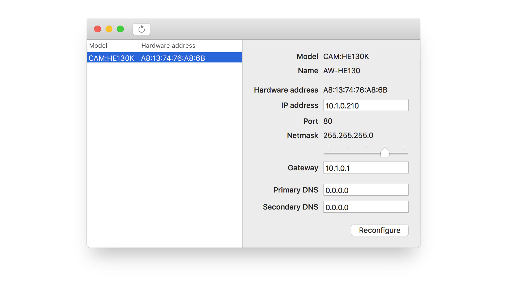

# Panasonic IP setup
macOS application to discover and configure network settings of Panasonic cameras. Alternative to the *windows only* [Easy IP Setup Tool](https://security.panasonic.com/download/tools/#easy).



## Development setup

### Tool versioning
**Swift**
```
Apple Swift version 4.1 (swiftlang-902.0.48 clang-902.0.37.1)
Target: x86_64-apple-darwin17.5.0
```
**Xcode**
```
Version 9.3 (9E145)
(macOS 10.13.4 (17E199))
```

To start developing clone this repo with all its submodules
```shell
git clone --recurse-submodules git@github.com:dPro-Software/Panasonic-IP-setup.git
```
Generate the Xcode project for the BlueSocket SPM module
```
cd framework
swift package generate-xcodeproj
```
